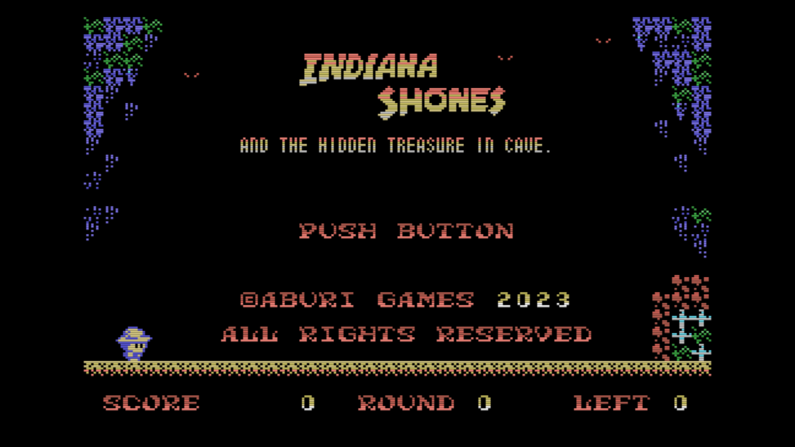
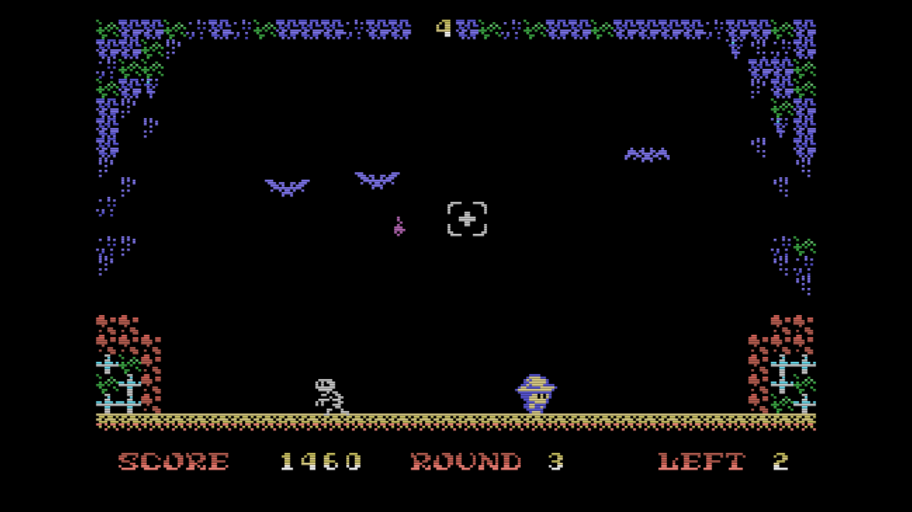

[Engligh](README.md) | [日本語](README_ja.md)

---
# MSX-INDIANA SHONES AND THE HIDDEN TRESURE IN CAVE

 

## Overview

This is a game in which the player exterminates bats in a cave and aims for a treasure in the back of the cave.  
It was created in MSX-BASIC.  

 

## Requirements

- MSX/2/2+/TurboR

 

## Play on WebMSX

- Please access the following URL.

https://webmsx.org/?MACHINE=MSXTRJ&DISKA_URL=https://github.com/aburi6800/msx-indianashones_part1/raw/main/Shones1.dsk&FAST_BOOT

 

## How to Play

- Defeat the bats in the cave.
- When a certain number of them are defeated, the round is cleared.
- The ending is after 5 rounds of clearing.
- Shones move left and right, and jumps when pressed upward.
- The sight can be moved with the cursor keys while holding down the space key.
- Release the space key to throw the knife.
- If you knock down a bat, you get a score based on the distance the knife flew. If you miss, you get -10pts.
- If the shorts hit a bat or other object, or if the score is zero, it is a miss.
- If you make a mistake when there is zero remaining, the game is over.

 

## Controls

- Cursor Key / Control Pad : Moving Shones and Sights
- Space Key / A Button : Start the game, press to move the sight, release to throw the knife.

 

## Thanks

- MSXPen : https://msxpen.com/
- Pasmo : https://pasmo.speccy.org/
- openmsx : https://openmsx.org/
- TinySprite : http://msx.jannone.org/tinysprite/tinysprite.html
- nMSXTiles : https://github.com/pipagerardo/nMSXtiles
- LovelyComposer : https://1oogames.itch.io/lovely-composer

 

## Licence

- MIT Licence
