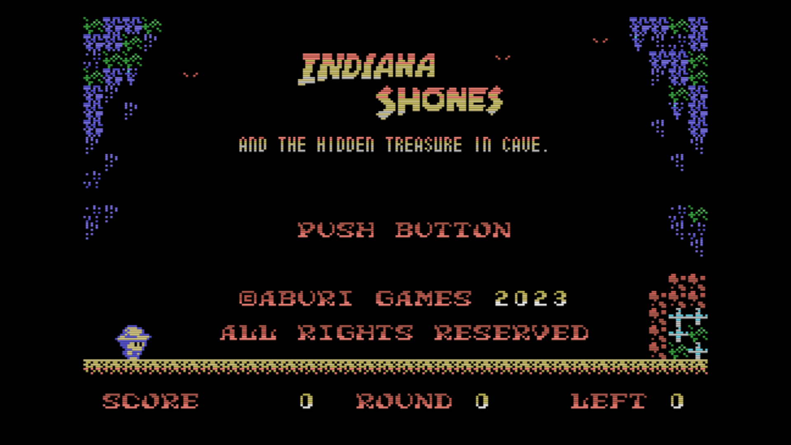
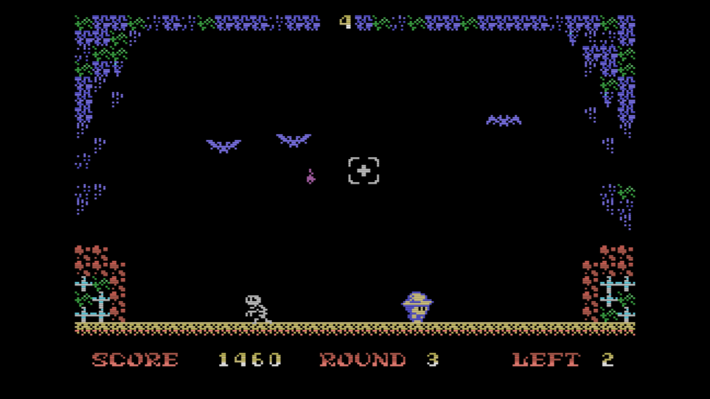

[Engligh](README.md) | [日本語](README_ja.md)

---
# MSX-インディ・ショーンズ 洞窟の秘宝

 

## 概要

洞窟のコウモリを退治して、奥にある財宝をめざすゲームです。  
MSX-BASICで作成しています。  

 

## 要件

- MSX/2/2+/TurboR

 

## WebMSXでの実行

- 以下のURLにアクセスしてください。

https://webmsx.org/?MACHINE=MSX1J&DISKA_URL=https://github.com/aburi6800/msx-indianashones_part1/raw/main/Shones1.dsk&FAST_BOOT

 

## How to Play

- 洞窟にいるコウモリを倒してください。
- 決まった数を倒すと、ラウンドクリアです。
- ５ラウンドクリアでエンディングです。
- ショーンズは左右に移動、上方向を押すとジャンプします。
- 照準はスペースキーを押しながらカーソルキーで動かせます。
- スペースキーを離すとナイフを投げます。
- コウモリを倒すと、ナイフが飛んだ距離に応じてスコアが入ります。外すと-10ptsです。
- ショーンズがコウモリなどにあたったり、スコアが0になるとミスになります。
- 残機がゼロのときにミスをすると、ゲームオーバーです。

 

## 操作方法

- カーソルキー or コントロールパッド : ショーンズ/照準の移動
- スペースキー or トリガボタン : ゲームスタート、押している間は照準移動、離すとナイフを投げる

 

## Thanks

- MSXPen : https://msxpen.com/
- Pasmo : https://pasmo.speccy.org/
- openmsx : https://openmsx.org/
- TinySprite : http://msx.jannone.org/tinysprite/tinysprite.html
- nMSXTiles : https://github.com/pipagerardo/nMSXtiles
- LovelyComposer : https://1oogames.itch.io/lovely-composer

 

## ライセンス

- MITライセンスとします。
ソフトウェアは自由に扱って構いませんが、再頒布時に著作権表示とライセンス表示を含めてください。  
また、作者や著作権者はいかなる責任も負いません。  

